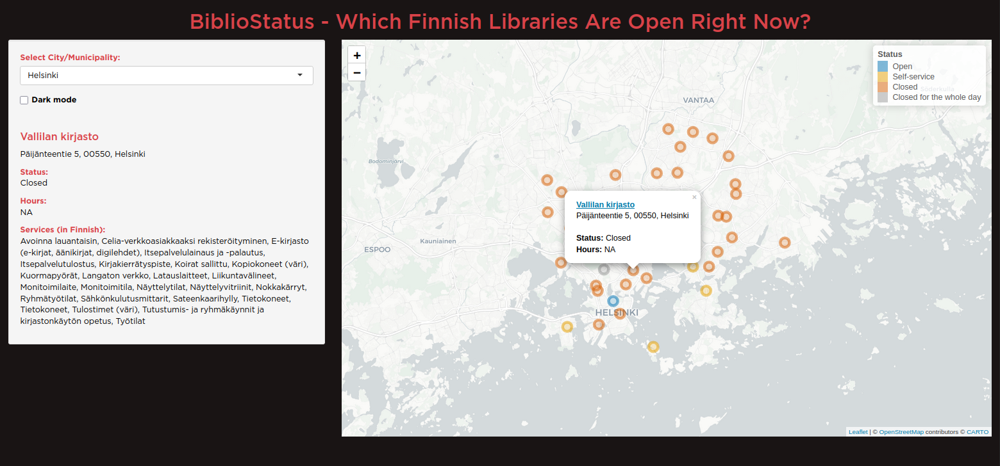

# 📚 BiblioStatus

**BiblioStatus** is a web app that shows the real-time opening status of Finnish public libraries on a map.

## 🔍 Features

- 🌍 Interactive map with open/self-service/closed statuses color-coded
- 📍 **Find Nearest Open Library** - Uses GPS to find 3-5 closest open libraries with distances
- 🗺️ **Get Directions** - One-click Google Maps navigation to any library
- 📱 Mobile-optimized layout with responsive sidebar and touch controls
- 📞 **Contact Information** - Phone and email links for each library
- 📅 **Complete Daily Schedule** - View all opening periods (e.g., "10:00-14:00 Open, 14:00-20:00 Self-service")
- 🌗 Dark mode toggle
- 🏢 City/municipality filter
- 🔗 Clickable popups with library information and links
- 📦 Data updated daily via GitHub Actions and stored in SQLite
- ✅ Automated URL monitoring with email alerts for broken links

## 📸 Screenshot



## 🚀 Live App

👉 [Try it here!](https://bibliostatus.youcanbeapirate.com)

## 🛠️ Project Structure

```bash
fetch_library_data.R        # Pulls data from Kirkanta API (v4)
check_library_urls.R        # Validates all library URLs
.github/workflows/
├── fetch_data.yml          # Nightly data fetch (2:00 AM UTC)
├── check_library_urls.yml  # Daily URL validation (3:00 AM UTC)
└── deploy_shiny_app.yml    # Deploy to Google Cloud Run
app/
├── libraries.sqlite        # SQLite database (updated nightly)
├── run.R                   # App entry point (host/port config)
├── server.R                # Server logic, geolocation, distance calculations
├── ui.R                    # UI with map, sidebar, "Find Nearest" feature
└── www/
    ├── functions.R         # Database queries, Haversine distance formula
    ├── styles.css          # Mobile-responsive CSS
    └── variables.R         # Color config for map markers
```

## 🔄 Data Pipeline

1. GitHub Actions runs `fetch_library_data.R` nightly at 2:00 AM UTC
2. Fetches library info + schedules from [Kirkanta API (v4)](https://api.kirjastot.fi/)
3. Saves to `libraries.sqlite` in `app/`
4. App loads the database on startup

## ✅ Data Quality & URL Monitoring

All library website URLs are automatically monitored daily:

- **Daily checks** run at 3:00 AM UTC (after data fetch)
- Validates all 720 library URLs for availability
- Email alerts sent if broken URLs are detected
- **Current status**: 95% working (683/720 libraries)
- Broken URLs are investigated and corrected within 24-48 hours

The monitoring workflow ensures users always have access to working library website links.

## 🔐 Deployment

This project is deployed as a Docker container on Google Cloud Run. See [DEPLOY.md](DEPLOY.md) for full instructions

Quick deploy:

```bash
./deploy.sh
```

## 🧪 Local Development

With Docker:

```bash
docker compose up --build
# Open http://localhost:8082
```

Or directly with R:

```r
renv::restore()
source("fetch_library_data.R")
shiny::runApp("app/")
```

## 📦 Required R Packages

- [dplyr](https://dplyr.tidyverse.org/)
- [here](https://here.r-lib.org/)
- [jsonlite](https://github.com/jeroen/jsonlite)
- [leaflet](https://rstudio.github.io/leaflet/)
- [purrr](https://purrr.tidyverse.org/)
- [RSQLite](https://rsqlite.r-dbi.org/)
- [shiny](https://shiny.posit.co/r/getstarted/shiny-basics/lesson1/)
- [shinyjs](https://deanattali.com/shinyjs/)
- [stringr](https://stringr.tidyverse.org/)

## 📄 License

- [MIT](https://opensource.org/license/mit)
